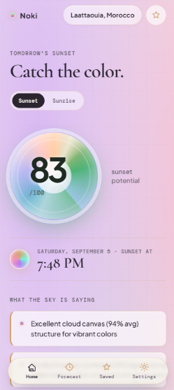
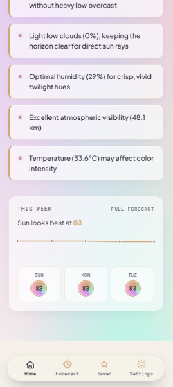
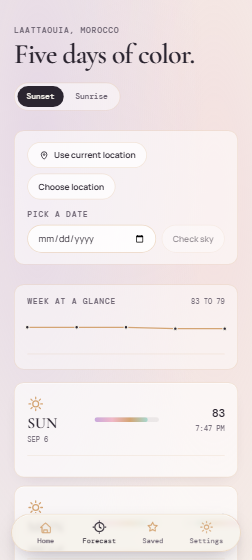

# Noki - Sunset & Sunrise Quality Prediction App

Noki is your personal sunset/sunrise quality predictor that tells you exactly how beautiful your next twilight moment will be. Whether you're planning a romantic evening walk, a photography session, or just want to know if today's sunset will be worth watching, Noki gives you the real answer: a simple 0-100 score with detailed explanations of why.

## What Makes Noki Special?

Noki isn't just another weather app - it's your dedicated companion for capturing the perfect moments when the sky transforms into a masterpiece. Imagine having a crystal ball that tells you exactly how stunning today's sunset will be, with scientific precision backed by real-time meteorological data.

**What sets Noki apart:**
- **Scientific Accuracy**: Powered by Open-Meteo's comprehensive weather data
- **Mobile-First Design**: Built specifically for touchscreens and on-the-go lifestyle
- **Privacy Guaranteed**: No accounts, no tracking, everything stays on your device
- **Real Results**: Not just predictions, but explanations of why that score matters

**Key Features:**
- **Real-time Location Detection**: Automatically finds your position or allows manual search
- **6-Factor Analysis**: Cloud cover, mid/high clouds, low horizon clouds, humidity, visibility, precipitation, and temperature
- **Mobile Optimized**: Touch-friendly interface designed for smooth scrolling and performance
- **Privacy First**: No account required, all data stored locally
- **Visual Feedback**: Color-coded scores with detailed explanations

## Preview Images





## Get going

### Run on your machine

```bash
# Backend in one terminal
$env:PYTHONPATH="src"
uvicorn sunset_score.api:app --reload

# Frontend in another terminal
cd frontend
npm run dev
```

### Check on mobile
```bash
# Run the test helper
.\test-setup.bat
```

### Production build
```bash
# Start with Docker Compose
docker-compose up --build
```

## How Noki Works

### The 6-Factor Sunset & Sunrise Analysis
Noki uses a sophisticated 6-part scoring system to predict sunset and sunrise quality:

- **Cloud Cover**: Overall sky coverage (0-10 points)
- **Mid/High Cloud Canvas**: Color scattering potential from altocumulus and cirrus clouds (0-25 points)
- **Low Cloud Horizon**: Horizon clearance for direct sun rays (0-20 points)
- **Relative Humidity**: Atmospheric clarity and moisture balance (0-10 points)
- **Visibility**: Air quality and viewing distance (0-10 points)
- **Temperature-Based Color**: Optimal color development range (15°C-25°C) (0-15 points)

### What You'll Get
- **Simple 0-100 Score**: Easy-to-understand quality rating
- **Detailed Explanations**: Why you got that score, not just the number
- **5-Day Forecast**: Trend analysis with best-day highlighting
- **Real-Time Updates**: Live scoring as weather conditions change

### Mobile Experience
- **Smart Location Detection**: Automatic GPS with manual search fallback
- **Secure Context Handling**: HTTPS guidance for mobile browsers
- **Touch-Optimized Interface**: Smooth scrolling and responsive design
- **Performance First**: Minimal backdrop-filter for fast mobile scrolling

### Privacy & Security
- **No Account Required**: Everything works without sign-in
- **Local Data Storage**: All information stays on your device
- **Secure Error Messages**: Clear guidance when location access needs HTTPS
- **Manual Entry Always Available**: Even when geolocation fails

## Understanding the Scoring

### 6-Factor Analysis
The app analyzes **six key factors** to determine sunset/sunrise quality:

| Factor | Points | What It Measures |
|--------|--------|------------------|
| Total Cloud Cover | 0-10 | Overall sky coverage |
| Mid/High Cloud Canvas | 0-25 | Color scattering potential |
| Low Cloud Horizon | 0-20 | Horizon clearance |
| Relative Humidity | 0-10 | Atmospheric clarity |
| Visibility | 0-10 | Air quality and distance |
| Temperature-Based Color | 0-15 | Optimal color development |

### Score Interpretation
- **90-100**: Perfect conditions - exceptional colors expected
- **70-89**: Excellent - great sunset/sunrise ahead
- **50-69**: Good - pleasant colors with some character
- **30-49**: Fair - visible but not spectacular
- **0-29**: Poor - limited color potential

## Technical Specifications

### Frontend Stack
- **Framework**: React 19 with TypeScript
- **Build Tool**: Vite for rapid development
- **Styling**: CSS with custom properties
- **State Management**: React Context API
- **Mobile Features**: Capacitor integration

### Backend Stack
- **Framework**: FastAPI with Python 3.14
- **Database**: SQLite with local caching
- **Weather Integration**: Open-Meteo API
- **CORS**: Fully permissive for mobile access

## Performance Optimizations

### Mobile-First Design
- **Minimal Backdrop-Filter**: Reduced GPU usage for smooth scrolling
- **Transform-Based Animations**: GPU-accelerated animations
- **Efficient Rendering**: Optimized component tree
- **Touch Targets**: Properly sized for mobile interaction

### Development Experience
- **Hot Reload**: Instant feedback during development
- **Type Safety**: Full TypeScript support
- **Linting**: Code quality enforcement
- **Build Optimization**: Production-ready bundling

## Troubleshooting

### Common Issues

**Backend Won't Start**
```powershell
# Check Python path
$env:PYTHONPATH="src"
uvicorn sunset_score.api:app --reload
```

**Frontend Won't Load**
```bash
cd frontend
npm run dev
```

**Mobile Connection Issues**
- Ensure backend is running on `http://127.0.0.1:8000`
- Check firewall settings
- Verify same network connectivity

### Getting Help
1. **Check Logs**: Review terminal output for errors
2. **Test Backend**: `curl http://127.0.0.1:8000/health`
3. **Test Frontend**: Visit `http://localhost:5173`
4. **Mobile Test**: Use `http://192.168.x.x:5173` on phone

## Development

### Running Tests
```bash
# Python tests
pytest

# Frontend linting
cd frontend
npm run lint
```

### Code Quality
- Follow existing code style and conventions
- Add tests for new features
- Update documentation
- Run linting before committing

## 🎨 Design Philosophy

### Mobile-First Approach
- **Touch Optimized**: All interactions designed for mobile
- **Performance First**: Minimal GPU usage for smooth scrolling
- **Accessibility**: Screen reader compatible and keyboard navigable
- **Visual Hierarchy**: Clear information architecture

### User Experience
- **Progressive Disclosure**: Show only what's needed
- **Clear Feedback**: Visual and haptic responses
- **Error Recovery**: Always provide fallback options
- **Offline Capability**: Local caching for intermittent connectivity

## 🔄 Future Enhancements

### Planned Features
- **Weather Alerts**: Push notifications for optimal conditions
- **Social Sharing**: Share your perfect moments
- **Custom Locations**: Save and manage favorite spots
- **Advanced Analytics**: Detailed weather pattern analysis

### Performance Goals
- **60fps Scrolling**: Smooth mobile scrolling experience
- **Instant Load**: Fast initial page load times
- **Offline Support**: Full functionality without internet
- **Battery Optimization**: Minimal power consumption

---

**Ready to explore the skies?** Start with the quick setup commands above and discover your perfect sunset moments!

---

*Made with by Jazzy (Rayan Ait jilali)*